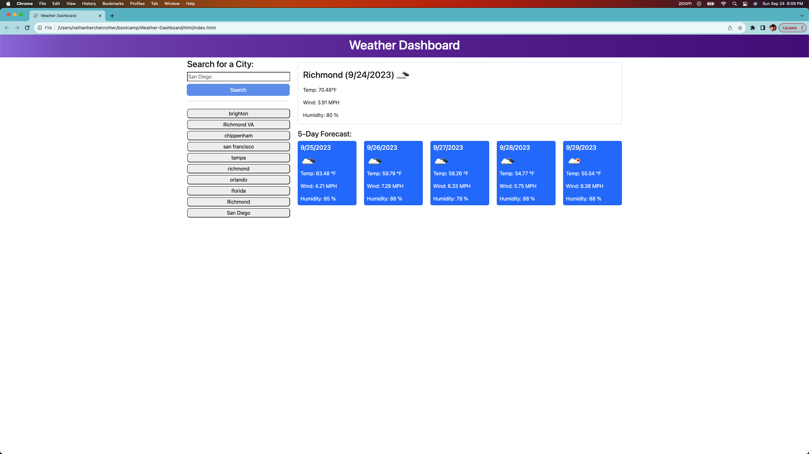

# Weather Dashboard Application

## Description

- My motivation behind this project was to create an interactive Weather Application that could search locations and provide a weather forecast over the next 5 days, along with todays forecast.
- I built this project to help people plan out their vacations by allowing them to search for weather in different destinations they might be planning to go on. 
- This allows for a centralized location to keep and research weather for various locations. It saves the locations in the local history to prevent having to go back and forth amongst different ones. 
- I learned how to traverse an API and render the information received from it.  I learned how to call the API and receive information and what the data might look like from other APIs when a request is sent and the data is received.  

## Table of Contents 

- [Installation](#installation)
- [Usage](#usage)
- [License](#license)

## Installation

The application is started by entering the url https://hershrva.github.io/WeatherDashboardApp/ into the browser.  The app is then able to be used without any further installation.

## Usage

The application works by opening the url (https://hershrva.github.io/WeatherDashboardApp/) in a browser. (Screenshot #1)
The user can then type any city in the search bar and hit enter or click the search button.  The application will then render the current weather and 5 day weather forecast for that location, as well as saving the search the the search history where those can be clicked to bring up that cities weather.

## License

MIT License

Copyright (c) 2023 hershRVA

Permission is hereby granted, free of charge, to any person obtaining a copy
of this software and associated documentation files (the "Software"), to deal
in the Software without restriction, including without limitation the rights
to use, copy, modify, merge, publish, distribute, sublicense, and/or sell
copies of the Software, and to permit persons to whom the Software is
furnished to do so, subject to the following conditions:

The above copyright notice and this permission notice shall be included in all
copies or substantial portions of the Software.

THE SOFTWARE IS PROVIDED "AS IS", WITHOUT WARRANTY OF ANY KIND, EXPRESS OR
IMPLIED, INCLUDING BUT NOT LIMITED TO THE WARRANTIES OF MERCHANTABILITY,
FITNESS FOR A PARTICULAR PURPOSE AND NONINFRINGEMENT. IN NO EVENT SHALL THE
AUTHORS OR COPYRIGHT HOLDERS BE LIABLE FOR ANY CLAIM, DAMAGES OR OTHER
LIABILITY, WHETHER IN AN ACTION OF CONTRACT, TORT OR OTHERWISE, ARISING FROM,
OUT OF OR IN CONNECTION WITH THE SOFTWARE OR THE USE OR OTHER DEALINGS IN THE
SOFTWARE.

